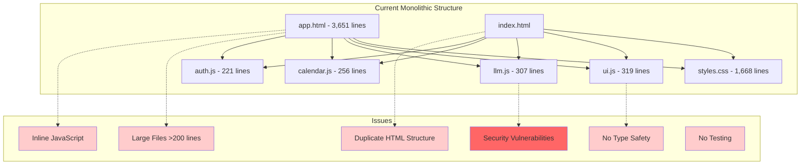
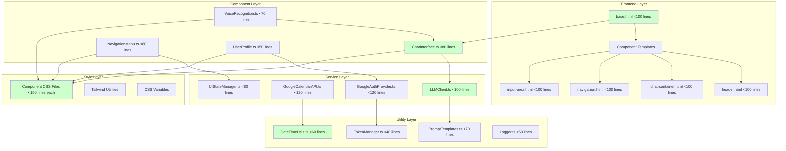
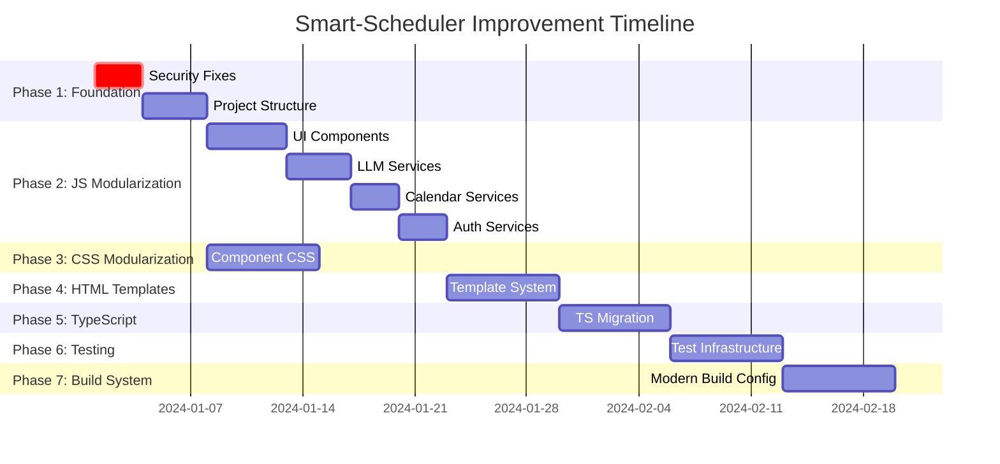
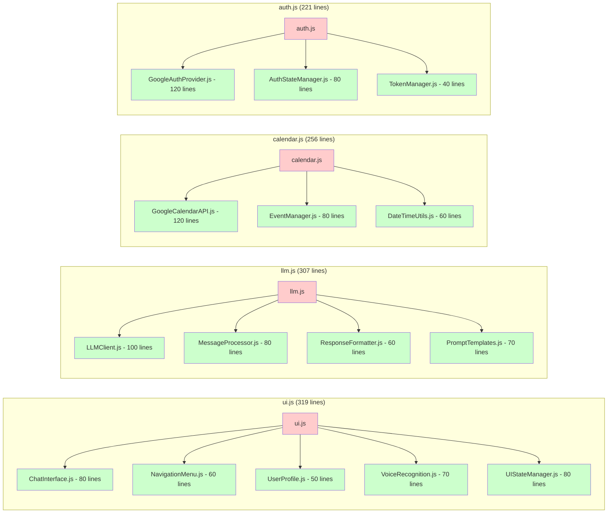
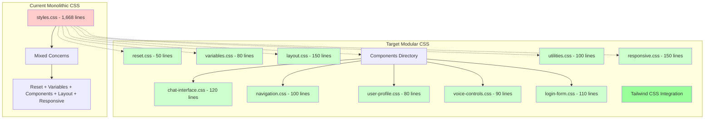
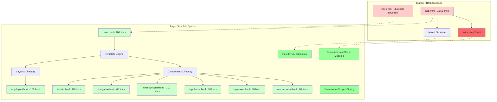
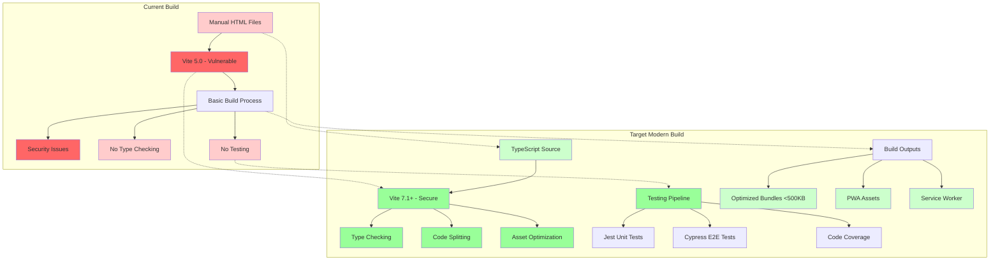
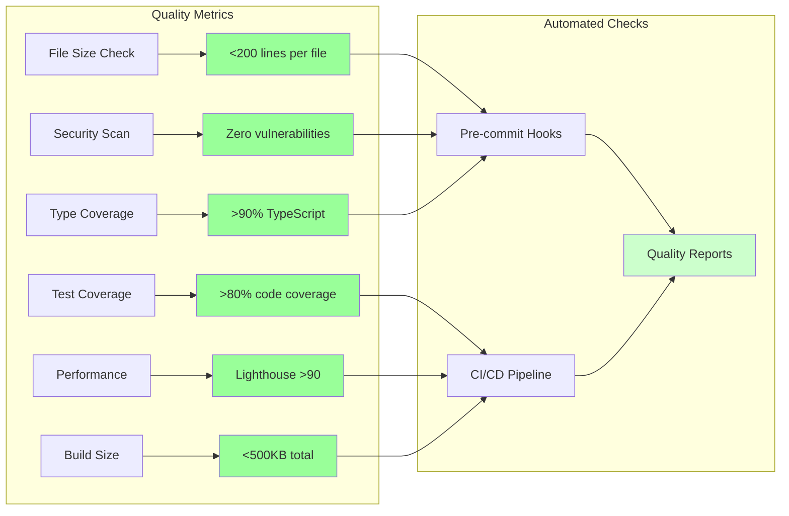

# Smart-Scheduler Improvement Architecture Diagrams

## Current State Architecture

## Target Modular Architecture

## Phase Implementation Flow

## File Splitting Strategy

## CSS Architecture Transformation

## HTML Template Component System

## Build System Architecture

## Quality Gates and Metrics

## Legend
- 🔴 Red: Current problematic state (>200 lines, security issues)
- 🟡 Yellow: Intermediate state (needs improvement)
- 🟢 Light Green: Target compliant state (<200 lines)
- 🟢 Dark Green: Enhanced features (TypeScript, testing, modern build)

These diagrams provide a comprehensive visual guide for the Smart-Scheduler improvement process, showing the transformation from the current monolithic structure to a modern, modular architecture that adheres to the 200-line file limit and implements best practices for maintainability, security, and performance.