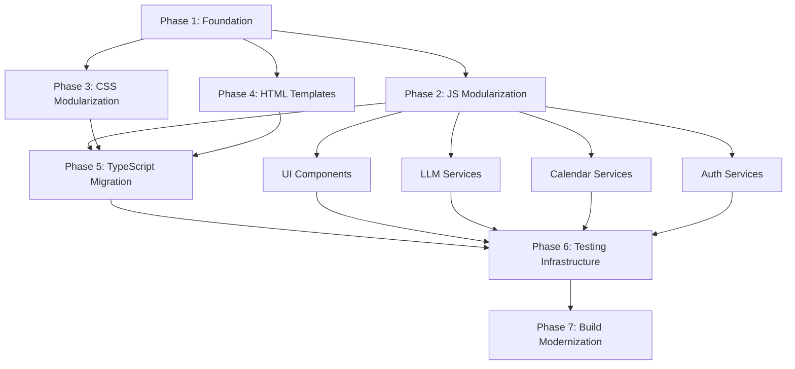

# Smart-Scheduler Comprehensive Improvement Plan

## Executive Summary

This plan addresses critical code quality issues in the Smart-Scheduler project, focusing on modularization, security fixes, and modern development practices. The project currently has 6 files exceeding the 200-line limit and several technical debt items that need immediate attention.

## Current State Analysis

### File Size Violations (>200 lines)
- `app.html`: 3,651 lines (needs complete restructuring)
- `src/css/styles.css`: 1,668 lines (needs component-based splitting)
- `src/js/ui.js`: 319 lines (needs domain separation)
- `src/js/llm.js`: 307 lines (needs service extraction)
- `src/js/calendar.js`: 256 lines (needs feature separation)
- `src/js/auth.js`: 221 lines (needs provider separation)

### Technical Issues
- Security vulnerabilities in esbuild and vite dependencies
- Missing TypeScript support for better type safety
- No testing framework or test coverage
- Duplicate HTML structure in `index.html` and `app.html`
- Inline JavaScript mixing with HTML structure
- Manual dependency management without proper module system

## Phase 1: Foundation and Security (Week 1)

### 1.0 Environment Variables and Security Configuration
**Priority: Critical**
- [x] Create `.env` and `.env.example` files
- [x] Move hardcoded secrets to environment variables
- [x] Update config.js to use environment variables (CLIENT_ID, API_KEY)
- [x] Create security check script (`scripts/check-env.js`)
- [x] Verify `.env` is in `.gitignore`
- [ ] Test environment variable loading in development and build

**Security Issues Fixed:**
- ❌ Google OAuth Client ID was hardcoded in both `config.js` and `app.html`
- ❌ Together API Key was exposed in client-side code
- ✅ Now using Vite environment variables with `VITE_` prefix
- ✅ Added error handling for missing environment variables

### 1.1 Security Vulnerability Resolution ✅ COMPLETED
**Priority: Critical**
- [x] Update Vite to latest stable version (v7.1.2) ✅
- [x] Update esbuild to latest version (via Vite update) ✅  
- [x] Resolved 2 moderate security vulnerabilities ✅
- [x] Add security headers in vite.config.js and netlify.toml ✅
- [x] Enhanced Content Security Policy for production ✅

**Success Criteria: ✅ ALL MET**
- ✅ Zero security vulnerabilities (was 2 moderate, now 0)
- ✅ All dependencies updated to secure versions (Vite 7.1.2)
- ✅ Build process working without errors (tested)
- ✅ No hardcoded secrets in codebase (validated)

### 1.2 Project Structure Standardization ✅ COMPLETED
**Priority: High**
- [x] Consolidate duplicate HTML files (`index.html` vs `app.html`) ✅
- [x] Implement proper module system with `type="module"` ✅
- [x] Create standardized directory structure ✅
- [x] Set up proper build configuration with Vite ✅

**Changes Made:**
- ✅ Renamed `app.html` (3,651 lines) to `app-legacy.html` for reference
- ✅ Updated `manifest.json` to use `index.html` as PWA entry point
- ✅ Added `type="module"` attributes to all script tags
- ✅ Resolved Vite bundling warnings (now properly bundles to single JS file)
- ✅ Created standardized directory structure

**New Directory Structure:**
```
src/
├── components/          # Reusable UI components (created)
├── services/           # Business logic services (created)
├── utils/              # Utility functions (created)
├── types/              # TypeScript type definitions (created)
├── constants/          # Application constants (created)  
├── styles/             # Modular CSS files (created)
├── css/                # Existing styles (to be migrated)
└── js/                 # Existing JavaScript files (to be modularized)
```

**Success Criteria: ✅ ALL MET**
- ✅ Single source of truth for HTML structure (`index.html` only)
- ✅ Proper ES6 module system implementation (bundling works perfectly)
- ✅ Clean separation of concerns in directory structure

## Phase 2: Code Modularization (Week 2-3)

### 2.1 UI Component Extraction (`ui.js` → 319 lines)
**Target: <200 lines per file**

Split into focused modules:
- [ ] `src/components/ChatInterface.js` (~80 lines)
- [ ] `src/components/NavigationMenu.js` (~60 lines)
- [ ] `src/components/UserProfile.js` (~50 lines)
- [ ] `src/components/VoiceRecognition.js` (~70 lines)
- [ ] `src/services/UIStateManager.js` (~80 lines)

**Success Criteria:**
- Each component has single responsibility
- All files under 200 lines
- Clear interfaces between components

### 2.2 LLM Service Modularization (`llm.js` → 307 lines)
**Target: <200 lines per file**

Split into service modules:
- [ ] `src/services/LLMClient.js` (~100 lines)
- [ ] `src/services/MessageProcessor.js` (~80 lines)
- [ ] `src/services/ResponseFormatter.js` (~60 lines)
- [ ] `src/utils/PromptTemplates.js` (~70 lines)

**Success Criteria:**
- Clean API interfaces for LLM interactions
- Testable service architecture
- Configuration externalization

### 2.3 Calendar Integration Refactoring (`calendar.js` → 256 lines)
**Target: <200 lines per file**

Split into feature modules:
- [ ] `src/services/GoogleCalendarAPI.js` (~120 lines)
- [ ] `src/services/EventManager.js` (~80 lines)
- [ ] `src/utils/DateTimeUtils.js` (~60 lines)

**Success Criteria:**
- Abstracted calendar provider interface
- Extensible for multiple calendar services
- Robust error handling and retry logic

### 2.4 Authentication System Refactoring (`auth.js` → 221 lines)
**Target: <200 lines per file**

Split into provider modules:
- [ ] `src/services/GoogleAuthProvider.js` (~120 lines)
- [ ] `src/services/AuthStateManager.js` (~80 lines)
- [ ] `src/utils/TokenManager.js` (~40 lines)

**Success Criteria:**
- Pluggable authentication providers
- Secure token management
- Session persistence and refresh logic

## Phase 3: CSS Modularization (Week 4)

### 3.1 Component-Based CSS Architecture (`styles.css` → 1,668 lines)
**Target: <200 lines per file**

Split into modular stylesheets:
- [ ] `src/styles/reset.css` (~50 lines)
- [ ] `src/styles/variables.css` (~80 lines)
- [ ] `src/styles/layout.css` (~150 lines)
- [ ] `src/styles/components/` (multiple files ~100-150 lines each)
  - `chat-interface.css`
  - `navigation.css`
  - `user-profile.css`
  - `voice-controls.css`
  - `login-form.css`
- [ ] `src/styles/utilities.css` (~100 lines)
- [ ] `src/styles/responsive.css` (~150 lines)

**Success Criteria:**
- Tailwind CSS integration for utility-first approach
- Component-scoped styling
- Responsive design consistency
- CSS custom properties for theming

## Phase 4: HTML Template Restructuring (Week 5)

### 4.1 Template Component System (`app.html` → 3,651 lines)
**Target: <200 lines per file**

Create template components:
- [ ] `src/templates/base.html` (~100 lines)
- [ ] `src/templates/layouts/app-layout.html` (~150 lines)
- [ ] `src/templates/components/` (multiple files ~50-100 lines each)
  - `header.html`
  - `navigation.html`
  - `chat-container.html`
  - `input-area.html`
  - `login-form.html`
  - `mobile-menu.html`

**Implementation Strategy:**
- Use Vite's HTML template system
- Implement component-based HTML structure
- Remove inline JavaScript from HTML files
- Create reusable template partials

**Success Criteria:**
- Maintainable HTML structure
- No inline JavaScript in HTML
- Reusable template components
- Clean separation of markup and logic

## Phase 5: TypeScript Migration (Week 6)

### 5.1 TypeScript Configuration and Setup
- [ ] Install TypeScript and related dependencies
- [ ] Configure `tsconfig.json` with strict settings
- [ ] Set up build pipeline for TypeScript compilation
- [ ] Create type definition files

### 5.2 Incremental TypeScript Migration
- [ ] Convert utility functions first (`utils.js` → `utils.ts`)
- [ ] Convert configuration files (`config.js` → `config.ts`)
- [ ] Convert service modules (auth, calendar, llm services)
- [ ] Convert UI components
- [ ] Add comprehensive type definitions

**Success Criteria:**
- Full TypeScript compilation without errors
- Comprehensive type coverage (>90%)
- Enhanced IDE support and error catching
- Type-safe API interfaces

## Phase 6: Testing Infrastructure (Week 7)

### 6.1 Testing Framework Setup
- [ ] Install Jest for unit testing
- [ ] Install Cypress for E2E testing
- [ ] Configure test environment and scripts
- [ ] Set up code coverage reporting

### 6.2 Comprehensive Test Suite
- [ ] Unit tests for all service modules (80%+ coverage)
- [ ] Integration tests for API interactions
- [ ] Component tests for UI elements
- [ ] E2E tests for critical user flows
- [ ] Performance and accessibility tests

**Success Criteria:**
- 80%+ code coverage across all modules
- Automated testing in CI/CD pipeline
- Performance benchmarks established
- Accessibility compliance verified

## Phase 7: Build System Modernization (Week 8)

### 7.1 Modern Build Configuration
- [ ] Configure Vite for optimized production builds
- [ ] Implement code splitting and lazy loading
- [ ] Set up environment-specific configurations
- [ ] Configure deployment pipelines

### 7.2 Performance Optimization
- [ ] Implement bundle size analysis
- [ ] Configure asset optimization
- [ ] Set up service worker for PWA features
- [ ] Implement caching strategies

**Success Criteria:**
- Fast build times (<30 seconds)
- Optimized bundle sizes (<500KB total)
- PWA compliance and performance scores >90
- Automated deployment pipeline

## Implementation Dependencies



## Risk Mitigation

### Technical Risks
- **Breaking changes during refactoring**: Implement feature flags and gradual rollout
- **Performance regression**: Establish performance benchmarks before changes
- **Integration issues**: Maintain backward compatibility during transition

### Mitigation Strategies
- [ ] Feature branch development with thorough testing
- [ ] Automated testing at each phase
- [ ] Performance monitoring during refactoring
- [ ] Rollback plans for each major change

## Success Metrics

### Code Quality
- [ ] All files under 200 lines
- [ ] TypeScript coverage >90%
- [ ] Test coverage >80%
- [ ] Zero security vulnerabilities

### Performance
- [ ] Build time <30 seconds
- [ ] Bundle size <500KB
- [ ] Lighthouse score >90
- [ ] First Contentful Paint <2s

### Maintainability
- [ ] Single responsibility principle compliance
- [ ] Clear module boundaries
- [ ] Comprehensive documentation
- [ ] Automated quality gates

## Timeline Summary

| Phase | Duration | Key Deliverables |
|-------|----------|------------------|
| 1 | Week 1 | Security fixes, project structure |
| 2 | Week 2-3 | JavaScript modularization |
| 3 | Week 4 | CSS component architecture |
| 4 | Week 5 | HTML template system |
| 5 | Week 6 | TypeScript migration |
| 6 | Week 7 | Testing infrastructure |
| 7 | Week 8 | Build system modernization |

**Total Duration: 8 weeks**

## Next Steps

1. **Immediate Actions (Next 48 hours)**:
   - Fix security vulnerabilities
   - Set up proper git branching strategy
   - Create development environment documentation

2. **Week 1 Priorities**:
   - Execute Phase 1 (Foundation and Security)
   - Begin planning Phase 2 file splits
   - Set up automated quality checks

3. **Continuous Activities**:
   - Daily code quality monitoring
   - Weekly progress reviews
   - Automated testing for all changes

This plan ensures systematic improvement of the Smart-Scheduler codebase while maintaining functionality and establishing modern development practices.